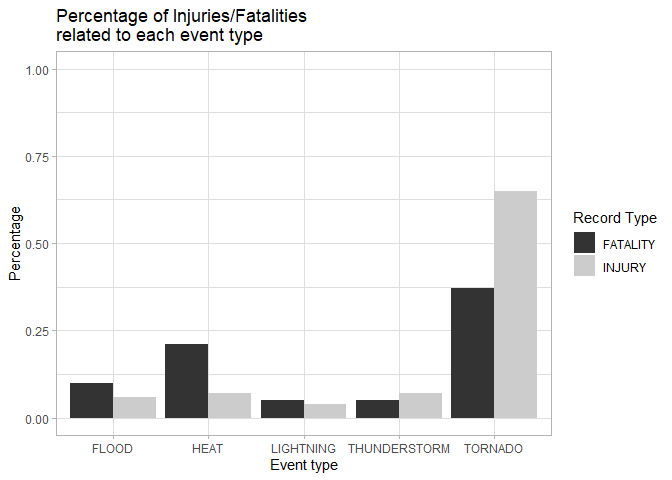
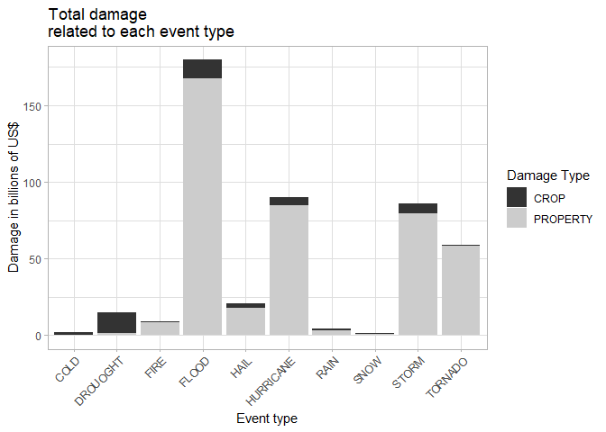

Exploratory Data Analysis of the NOAA Storm Database
================
Vítor dos Santos Araujo

## Synopsis

The goal of this analysis was to use the **U.S. National Oceanic and
Atmospheric Administration’s (NOAA) Storm Database** to discover which
type of events were most harmful with respect to population health and
economy in the time period recorded (from 1950 to 2011).

The criteria used to define the most harmful events were the number of
**injuries** and **fatalities** recorded for each fo them, while in
respect to the economy it was the total **property** and **crop
damage**.

During the analysis it was discovered that there was some
inconsistencies in the **Event Type** information, like the absence of a
standard and some overlapping of events. So some data cleaning was
needed.

As result of the analysis, it was discovered that, from the events
recorded, **Tornadoes** were responsible for most of the health
problems, while **Floods** caused the greatest part of the economic
damage.

## Data Processing

Loading libraries

``` r
library(dplyr)
library(ggplot2)
library(gridExtra)
library(knitr)
library(kableExtra)
```

Downloading the file and assigning it to the variable StormData .

``` r
file_url = "https://d396qusza40orc.cloudfront.net/repdata%2Fdata%2FStormData.csv.bz2"
download.file(file_url,
              "StormData.csv.bz2")
StormData <- read.csv("StormData.csv.bz2")
```

Since the goal of this analysis is to find the relation between
different event types and it’s consequences to the economy and
population health, I will use the **Event Type**, **Injuries**,
**Fatalities**, **Property Damage** and **Crop Damage** information from
`StormData` , as well as the indicators of the magnitude of the damages
`PROPDMGEXP` and `CROPDMGEXP`.

First, I’ll check if the is any missing data for these columns:

``` r
print(with(StormData,
           c(EVTYPE = sum(is.na(EVTYPE)),
             INJURIES = sum(is.na(INJURIES)),
             FATALITIES = sum(is.na(FATALITIES)),
             PROPDMG = sum(is.na(PROPDMG)),
             CROPDMG = sum(is.na(CROPDMG)),
             PROPDMGEXP = sum(is.na(PROPDMGEXP)),
             CROPDMGEXP = sum(is.na(CROPDMGEXP))
             )
           )
      )
```

    ##     EVTYPE   INJURIES FATALITIES    PROPDMG    CROPDMG PROPDMGEXP CROPDMGEXP 
    ##          0          0          0          0          0          0          0

Since there is no missing data let’s start the analysis for the impact
on health and economy.

## Population health

First, I’ll group the observations by **Event Type**. The `health_data`
will show the number of events and total numbers of **Injuries**,
**Fatalities**.

``` r
health_data <- StormData %>%
    group_by(EVTYPE) %>%
    summarise(N.EVENTS = n(),
              INJURIES = sum(INJURIES),
              FATALITIES = sum(FATALITIES)
              )
str(health_data)
```

    ## tibble [985 x 4] (S3: tbl_df/tbl/data.frame)
    ##  $ EVTYPE    : chr [1:985] "   HIGH SURF ADVISORY" " COASTAL FLOOD" " FLASH FLOOD" " LIGHTNING" ...
    ##  $ N.EVENTS  : int [1:985] 1 1 1 1 4 1 1 1 1 4 ...
    ##  $ INJURIES  : num [1:985] 0 0 0 0 0 0 0 0 0 0 ...
    ##  $ FATALITIES: num [1:985] 0 0 0 0 0 0 0 0 0 0 ...

It shows that there are 985 different **EVTYPEs** in the `StormData`,
but looking at the [Storm Data
Documentation](https://d396qusza40orc.cloudfront.net/repdata%2Fpeer2_doc%2Fpd01016005curr.pdf)
(Item 7), there seems to be less than 100 possible types. Let’s make a
small test to check what the problem might be:

``` r
health_data %>%
select(EVTYPE, N.EVENTS) %>%
arrange(desc(N.EVENTS)) %>%
head()%>%
kable() %>%
kable_styling(full_width = F)
```

<table class="table" style="width: auto !important; margin-left: auto; margin-right: auto;">
<thead>
<tr>
<th style="text-align:left;">
EVTYPE
</th>
<th style="text-align:right;">
N.EVENTS
</th>
</tr>
</thead>
<tbody>
<tr>
<td style="text-align:left;">
HAIL
</td>
<td style="text-align:right;">
288661
</td>
</tr>
<tr>
<td style="text-align:left;">
TSTM WIND
</td>
<td style="text-align:right;">
219940
</td>
</tr>
<tr>
<td style="text-align:left;">
THUNDERSTORM WIND
</td>
<td style="text-align:right;">
82563
</td>
</tr>
<tr>
<td style="text-align:left;">
TORNADO
</td>
<td style="text-align:right;">
60652
</td>
</tr>
<tr>
<td style="text-align:left;">
FLASH FLOOD
</td>
<td style="text-align:right;">
54277
</td>
</tr>
<tr>
<td style="text-align:left;">
FLOOD
</td>
<td style="text-align:right;">
25326
</td>
</tr>
</tbody>
</table>

It seems like there might be some problem with the standards to register
the EVTYPE , since *THUNDERSTORM* may also appear abbreviated as *TSTM*.
Let’s check if there are more inconsistencies of this type:

``` r
unique(grep("HAIL", health_data$EVTYPE, value = TRUE))
```

    ##  [1] "DEEP HAIL"                  "FUNNEL CLOUD/HAIL"         
    ##  [3] "GUSTY WIND/HAIL"            "HAIL"                      
    ##  [5] "HAIL 0.75"                  "HAIL 0.88"                 
    ##  [7] "HAIL 075"                   "HAIL 088"                  
    ##  [9] "HAIL 1.00"                  "HAIL 1.75"                 
    ## [11] "HAIL 1.75)"                 "HAIL 100"                  
    ## [13] "HAIL 125"                   "HAIL 150"                  
    ## [15] "HAIL 175"                   "HAIL 200"                  
    ## [17] "HAIL 225"                   "HAIL 275"                  
    ## [19] "HAIL 450"                   "HAIL 75"                   
    ## [21] "HAIL 80"                    "HAIL 88"                   
    ## [23] "HAIL ALOFT"                 "HAIL DAMAGE"               
    ## [25] "HAIL FLOODING"              "HAIL STORM"                
    ## [27] "HAIL/ICY ROADS"             "HAIL/WIND"                 
    ## [29] "HAIL/WINDS"                 "HAILSTORM"                 
    ## [31] "HAILSTORMS"                 "LATE SEASON HAIL"          
    ## [33] "MARINE HAIL"                "NON SEVERE HAIL"           
    ## [35] "SMALL HAIL"                 "THUNDERSTORM HAIL"         
    ## [37] "THUNDERSTORM WIND/HAIL"     "THUNDERSTORM WINDS HAIL"   
    ## [39] "THUNDERSTORM WINDS/ HAIL"   "THUNDERSTORM WINDS/HAIL"   
    ## [41] "THUNDERSTORM WINDSHAIL"     "TORNADOES, TSTM WIND, HAIL"
    ## [43] "TSTM WIND/HAIL"             "WIND/HAIL"

So there is a big inconsistency in the `EVTYPE` field. Moreover, there
are some cases of overlapping in this field. Which is not surprising,
since they can happen at the same time, as *“TORNADOES, TSTM WIND,
HAIL”*. With that in mind, first I will focus only on events that caused
**injuries** or **fatalities** to find out which of them are most
harmful with respect to population health.

Filtering only the events that caused injuries or fatalities and also
calculate the percentage of this outcomes related to them:

``` r
health_data <- health_data %>%
    filter(INJURIES > 0 | FATALITIES > 0) %>%
    mutate(PERC.FATALITIES = FATALITIES / sum(FATALITIES),
           PERC.INJURIES = INJURIES / sum(INJURIES)) %>%
    select(EVTYPE,
           N.EVENTS,
           FATALITIES,
           PERC.FATALITIES,
           INJURIES,
           PERC.INJURIES
           )
str(health_data)
```

    ## tibble [220 x 6] (S3: tbl_df/tbl/data.frame)
    ##  $ EVTYPE         : chr [1:220] "AVALANCE" "AVALANCHE" "BLACK ICE" "BLIZZARD" ...
    ##  $ N.EVENTS       : int [1:220] 1 386 14 2719 2 12 3 650 38 143 ...
    ##  $ FATALITIES     : num [1:220] 1 224 1 101 1 1 0 3 2 1 ...
    ##  $ PERC.FATALITIES: num [1:220] 0.000066 0.01479 0.000066 0.006669 0.000066 ...
    ##  $ INJURIES       : num [1:220] 0 170 24 805 1 13 2 2 0 0 ...
    ##  $ PERC.INJURIES  : num [1:220] 0.00 1.21e-03 1.71e-04 5.73e-03 7.12e-06 ...

Let’s see what are the events related most of the **fatalities**

``` r
health_data %>%
    select(EVTYPE, FATALITIES, PERC.FATALITIES) %>%
    arrange(desc(FATALITIES)) %>%
    head(10) %>%
    kable %>%
    kable_styling(full_width = F)
```

<table class="table" style="width: auto !important; margin-left: auto; margin-right: auto;">
<thead>
<tr>
<th style="text-align:left;">
EVTYPE
</th>
<th style="text-align:right;">
FATALITIES
</th>
<th style="text-align:right;">
PERC.FATALITIES
</th>
</tr>
</thead>
<tbody>
<tr>
<td style="text-align:left;">
TORNADO
</td>
<td style="text-align:right;">
5633
</td>
<td style="text-align:right;">
0.3719379
</td>
</tr>
<tr>
<td style="text-align:left;">
EXCESSIVE HEAT
</td>
<td style="text-align:right;">
1903
</td>
<td style="text-align:right;">
0.1256520
</td>
</tr>
<tr>
<td style="text-align:left;">
FLASH FLOOD
</td>
<td style="text-align:right;">
978
</td>
<td style="text-align:right;">
0.0645758
</td>
</tr>
<tr>
<td style="text-align:left;">
HEAT
</td>
<td style="text-align:right;">
937
</td>
<td style="text-align:right;">
0.0618686
</td>
</tr>
<tr>
<td style="text-align:left;">
LIGHTNING
</td>
<td style="text-align:right;">
816
</td>
<td style="text-align:right;">
0.0538792
</td>
</tr>
<tr>
<td style="text-align:left;">
TSTM WIND
</td>
<td style="text-align:right;">
504
</td>
<td style="text-align:right;">
0.0332783
</td>
</tr>
<tr>
<td style="text-align:left;">
FLOOD
</td>
<td style="text-align:right;">
470
</td>
<td style="text-align:right;">
0.0310333
</td>
</tr>
<tr>
<td style="text-align:left;">
RIP CURRENT
</td>
<td style="text-align:right;">
368
</td>
<td style="text-align:right;">
0.0242984
</td>
</tr>
<tr>
<td style="text-align:left;">
HIGH WIND
</td>
<td style="text-align:right;">
248
</td>
<td style="text-align:right;">
0.0163750
</td>
</tr>
<tr>
<td style="text-align:left;">
AVALANCHE
</td>
<td style="text-align:right;">
224
</td>
<td style="text-align:right;">
0.0147904
</td>
</tr>
</tbody>
</table>

And most of the **injuries**

``` r
health_data %>%
    select(EVTYPE, INJURIES, PERC.INJURIES) %>%
    arrange(desc(INJURIES)) %>%
    head(10) %>%
    kable %>%
    kable_styling(full_width = F)
```

<table class="table" style="width: auto !important; margin-left: auto; margin-right: auto;">
<thead>
<tr>
<th style="text-align:left;">
EVTYPE
</th>
<th style="text-align:right;">
INJURIES
</th>
<th style="text-align:right;">
PERC.INJURIES
</th>
</tr>
</thead>
<tbody>
<tr>
<td style="text-align:left;">
TORNADO
</td>
<td style="text-align:right;">
91346
</td>
<td style="text-align:right;">
0.6500199
</td>
</tr>
<tr>
<td style="text-align:left;">
TSTM WIND
</td>
<td style="text-align:right;">
6957
</td>
<td style="text-align:right;">
0.0495061
</td>
</tr>
<tr>
<td style="text-align:left;">
FLOOD
</td>
<td style="text-align:right;">
6789
</td>
<td style="text-align:right;">
0.0483107
</td>
</tr>
<tr>
<td style="text-align:left;">
EXCESSIVE HEAT
</td>
<td style="text-align:right;">
6525
</td>
<td style="text-align:right;">
0.0464320
</td>
</tr>
<tr>
<td style="text-align:left;">
LIGHTNING
</td>
<td style="text-align:right;">
5230
</td>
<td style="text-align:right;">
0.0372168
</td>
</tr>
<tr>
<td style="text-align:left;">
HEAT
</td>
<td style="text-align:right;">
2100
</td>
<td style="text-align:right;">
0.0149436
</td>
</tr>
<tr>
<td style="text-align:left;">
ICE STORM
</td>
<td style="text-align:right;">
1975
</td>
<td style="text-align:right;">
0.0140541
</td>
</tr>
<tr>
<td style="text-align:left;">
FLASH FLOOD
</td>
<td style="text-align:right;">
1777
</td>
<td style="text-align:right;">
0.0126452
</td>
</tr>
<tr>
<td style="text-align:left;">
THUNDERSTORM WIND
</td>
<td style="text-align:right;">
1488
</td>
<td style="text-align:right;">
0.0105886
</td>
</tr>
<tr>
<td style="text-align:left;">
HAIL
</td>
<td style="text-align:right;">
1361
</td>
<td style="text-align:right;">
0.0096849
</td>
</tr>
</tbody>
</table>

So it’t clear that **TORNADO** is by far the the most harmful of the
events in the list, but **HEAT**, **FLOOD**, **THUNDERSTORM** and
**LIGHTNING** are also related to high numbers on both tables.

It is also important to consider the inconsistencies of the `EVTYPE`
field pointed before, so let’s create a new table `health_data2`, but
now only focusing on this five types of events, and searching for every
`EVTYPE` that has relation to it.

``` r
events <- c("TORNADO" = "TORNADO",
            "FLOOD" = "FLOOD",
            "HEAT" = "HEAT",
            "THUNDERSTORM" = "THUNDERSTORM|TSTM",
            "LIGHTNING" = "LIGHTNING"
            )

health_data_perc <- data.frame()

for (event in names(events)) {
    index <- grepl(events[event], health_data$EVTYPE)
    
    event_row <- data.frame("EVTYPE" = c(event),
                            "PERC.FATALITIES" = round(
                                sum(health_data[index, "PERC.FATALITIES"]),
                                2),
                            "PERC.INJURIES" = round(
                                sum(health_data[index, "PERC.INJURIES"]),
                                2),
                            row.names = NULL)

    health_data_perc <- rbind(health_data_perc,
                              event_row)
}

health_data_perc %>%
    arrange(desc(PERC.FATALITIES), desc(PERC.INJURIES)) %>%
    kable() %>%
    kable_styling(full_width = F)
```

<table class="table" style="width: auto !important; margin-left: auto; margin-right: auto;">
<thead>
<tr>
<th style="text-align:left;">
EVTYPE
</th>
<th style="text-align:right;">
PERC.FATALITIES
</th>
<th style="text-align:right;">
PERC.INJURIES
</th>
</tr>
</thead>
<tbody>
<tr>
<td style="text-align:left;">
TORNADO
</td>
<td style="text-align:right;">
0.37
</td>
<td style="text-align:right;">
0.65
</td>
</tr>
<tr>
<td style="text-align:left;">
HEAT
</td>
<td style="text-align:right;">
0.21
</td>
<td style="text-align:right;">
0.07
</td>
</tr>
<tr>
<td style="text-align:left;">
FLOOD
</td>
<td style="text-align:right;">
0.10
</td>
<td style="text-align:right;">
0.06
</td>
</tr>
<tr>
<td style="text-align:left;">
THUNDERSTORM
</td>
<td style="text-align:right;">
0.05
</td>
<td style="text-align:right;">
0.07
</td>
</tr>
<tr>
<td style="text-align:left;">
LIGHTNING
</td>
<td style="text-align:right;">
0.05
</td>
<td style="text-align:right;">
0.04
</td>
</tr>
</tbody>
</table>

The changes were not big, so it is a sign that the inconsistencies
didn’t have much influence in the results.

It is import to point that this last table indicates the percentage of
injuries/fatalities relatated to each event type, so some of the them
maybe included in more than one event type. e.g.: an injury may be
related to both **lightning** and **thunderstorm** if the `EVTYPE` fo
that observation was somethin like “*TSTM / LIGHTNING*”.

## Economy

An important point in this records is to verify the magnitude of the
damage in dollars. [The Storm Data
Documentation](https://d396qusza40orc.cloudfront.net/repdata%2Fpeer2_doc%2Fpd01016005curr.pdf),
in item 2.7, says “Estimates should be rounded to three significant
digits, followed by an alphabetical character signifying the magnitude
of the number, i.e., 1.55B for $1,550,000,000.

Alphabetical characters used to signify magnitude include “K” for
thousands, “M” for millions, and “B” for billions”. So let’s create a
variable with that information.

``` r
magnitude <- c("K" = 10**3,
               "M" = 10**6,
               "B" = 10**9
               )
```

Now let’s see the information available on each column.

``` r
unique(StormData$PROPDMGEXP)
```

    ##  [1] "K" "M" ""  "B" "m" "+" "0" "5" "6" "?" "4" "2" "3" "h" "7" "H" "-" "1" "8"

``` r
unique(StormData$CROPDMGEXP)
```

    ## [1] ""  "M" "K" "m" "B" "?" "0" "k" "2"

There are some unexpected values in these fields, let’s check how often
they appear. But first rulling out rows in which the damage was 0, since
in these cases the magnitude won’t matter.

``` r
economy_data <- StormData %>%
    filter(CROPDMG > 0 | PROPDMG > 0)

1-nrow(economy_data[toupper(economy_data$CROPDMGEXP) %in% names(magnitude),]) / nrow(economy_data)
```

    ## [1] 0.5920067

``` r
1-nrow(economy_data[toupper(economy_data$PROPDMGEXP) %in% names(magnitude),]) / nrow(economy_data)
```

    ## [1] 0.01880578

It seems like the strange indicators represent less than 2% of the
records in the **Property Damage**. However, in the **Crop Damage** the
number is pretty high. Let’s see what it might be.

``` r
economy_data %>%
    group_by(CROPDMGEXP) %>%
    summarise(n = n()) %>%
    kable() %>%
    kable_styling(full_width = F)
```

<table class="table" style="width: auto !important; margin-left: auto; margin-right: auto;">
<thead>
<tr>
<th style="text-align:left;">
CROPDMGEXP
</th>
<th style="text-align:right;">
n
</th>
</tr>
</thead>
<tbody>
<tr>
<td style="text-align:left;">
</td>
<td style="text-align:right;">
145037
</td>
</tr>
<tr>
<td style="text-align:left;">
?
</td>
<td style="text-align:right;">
6
</td>
</tr>
<tr>
<td style="text-align:left;">
0
</td>
<td style="text-align:right;">
17
</td>
</tr>
<tr>
<td style="text-align:left;">
B
</td>
<td style="text-align:right;">
7
</td>
</tr>
<tr>
<td style="text-align:left;">
k
</td>
<td style="text-align:right;">
21
</td>
</tr>
<tr>
<td style="text-align:left;">
K
</td>
<td style="text-align:right;">
97960
</td>
</tr>
<tr>
<td style="text-align:left;">
m
</td>
<td style="text-align:right;">
1
</td>
</tr>
<tr>
<td style="text-align:left;">
M
</td>
<td style="text-align:right;">
1982
</td>
</tr>
</tbody>
</table>

From the table, it is possible to see that this column was left blank in
most of the records, which is strange, but since the formulas to
calculate the estimates in APPENDIX B of the [Storm Data
Documentation](https://d396qusza40orc.cloudfront.net/repdata%2Fpeer2_doc%2Fpd01016005curr.pdf)
technically allows values of less than 1k dollars we will assume that
the magnitude is 1.

Let’s update the `economy_data` with the correct values for the damages.
Ruling out the records with invalid values for the magnitude.

``` r
economy_data <- economy_data %>%
    mutate(CROPDMGMAG = ifelse(CROPDMGEXP == "", 1, 0),
           PROPDMGMAG = ifelse(PROPDMGEXP == "", 1, 0)) %>%
    mutate(CROPDMGMAG = ifelse(toupper(CROPDMGEXP) %in% names(magnitude),
                               magnitude[toupper(CROPDMGEXP)],
                               CROPDMGMAG),
           PROPDMGMAG = ifelse(toupper(PROPDMGEXP) %in% names(magnitude),
                               magnitude[toupper(PROPDMGEXP)],
                               PROPDMGMAG)) %>%
    mutate(PROPDMG = PROPDMG * PROPDMGMAG,
           CROPDMG = CROPDMG * CROPDMGMAG) %>%
    select(EVTYPE, PROPDMG, CROPDMG) %>%
    group_by(EVTYPE) %>%
    summarise(PROPDMG = sum(PROPDMG),
            CROPDMG = sum(CROPDMG)) %>%
    arrange(desc(CROPDMG+PROPDMG))

economy_data %>%
    head(20) %>%
    kable(format.args = list(big.mark = ",")) %>%
    kable_styling(full_width = F)
```

<table class="table" style="width: auto !important; margin-left: auto; margin-right: auto;">
<thead>
<tr>
<th style="text-align:left;">
EVTYPE
</th>
<th style="text-align:right;">
PROPDMG
</th>
<th style="text-align:right;">
CROPDMG
</th>
</tr>
</thead>
<tbody>
<tr>
<td style="text-align:left;">
FLOOD
</td>
<td style="text-align:right;">
144,657,709,807
</td>
<td style="text-align:right;">
5,661,968,450
</td>
</tr>
<tr>
<td style="text-align:left;">
HURRICANE/TYPHOON
</td>
<td style="text-align:right;">
69,305,840,000
</td>
<td style="text-align:right;">
2,607,872,800
</td>
</tr>
<tr>
<td style="text-align:left;">
TORNADO
</td>
<td style="text-align:right;">
56,937,160,483
</td>
<td style="text-align:right;">
414,953,110
</td>
</tr>
<tr>
<td style="text-align:left;">
STORM SURGE
</td>
<td style="text-align:right;">
43,323,536,000
</td>
<td style="text-align:right;">
5,000
</td>
</tr>
<tr>
<td style="text-align:left;">
HAIL
</td>
<td style="text-align:right;">
15,732,266,777
</td>
<td style="text-align:right;">
3,025,954,453
</td>
</tr>
<tr>
<td style="text-align:left;">
FLASH FLOOD
</td>
<td style="text-align:right;">
16,140,811,717
</td>
<td style="text-align:right;">
1,421,317,100
</td>
</tr>
<tr>
<td style="text-align:left;">
DROUGHT
</td>
<td style="text-align:right;">
1,046,106,000
</td>
<td style="text-align:right;">
13,972,566,000
</td>
</tr>
<tr>
<td style="text-align:left;">
HURRICANE
</td>
<td style="text-align:right;">
11,868,319,010
</td>
<td style="text-align:right;">
2,741,910,000
</td>
</tr>
<tr>
<td style="text-align:left;">
RIVER FLOOD
</td>
<td style="text-align:right;">
5,118,945,500
</td>
<td style="text-align:right;">
5,029,459,000
</td>
</tr>
<tr>
<td style="text-align:left;">
ICE STORM
</td>
<td style="text-align:right;">
3,944,927,810
</td>
<td style="text-align:right;">
5,022,113,500
</td>
</tr>
<tr>
<td style="text-align:left;">
TROPICAL STORM
</td>
<td style="text-align:right;">
7,703,890,550
</td>
<td style="text-align:right;">
678,346,000
</td>
</tr>
<tr>
<td style="text-align:left;">
WINTER STORM
</td>
<td style="text-align:right;">
6,688,497,250
</td>
<td style="text-align:right;">
26,944,000
</td>
</tr>
<tr>
<td style="text-align:left;">
HIGH WIND
</td>
<td style="text-align:right;">
5,270,046,260
</td>
<td style="text-align:right;">
638,571,300
</td>
</tr>
<tr>
<td style="text-align:left;">
WILDFIRE
</td>
<td style="text-align:right;">
4,765,114,000
</td>
<td style="text-align:right;">
295,472,800
</td>
</tr>
<tr>
<td style="text-align:left;">
TSTM WIND
</td>
<td style="text-align:right;">
4,484,928,440
</td>
<td style="text-align:right;">
554,007,350
</td>
</tr>
<tr>
<td style="text-align:left;">
STORM SURGE/TIDE
</td>
<td style="text-align:right;">
4,641,188,000
</td>
<td style="text-align:right;">
850,000
</td>
</tr>
<tr>
<td style="text-align:left;">
THUNDERSTORM WIND
</td>
<td style="text-align:right;">
3,483,121,142
</td>
<td style="text-align:right;">
414,843,050
</td>
</tr>
<tr>
<td style="text-align:left;">
HURRICANE OPAL
</td>
<td style="text-align:right;">
3,172,846,000
</td>
<td style="text-align:right;">
19,000,000
</td>
</tr>
<tr>
<td style="text-align:left;">
WILD/FOREST FIRE
</td>
<td style="text-align:right;">
3,001,829,500
</td>
<td style="text-align:right;">
106,796,830
</td>
</tr>
<tr>
<td style="text-align:left;">
HEAVY RAIN/SEVERE WEATHER
</td>
<td style="text-align:right;">
2,500,000,000
</td>
<td style="text-align:right;">
0
</td>
</tr>
</tbody>
</table>

Let’s use the same method from the health analysis, and try to group
related event types to create a cleaner table.

Looking at the table above, I chose do create these ten groups:
**TORNADO**, **FLOOD**, **HURRICANE**, **DROUOGHT**, **HAIL**,
**STORM**, **FIRE**, **RAIN**, **COLD**, **SNOW**.

``` r
events <- c("TORNADO" = "TORNADO",
            "FLOOD" = "FLOOD",
            "HURRICANE" = "HURRICANE",
            "DROUOGHT" = "DROUGHT",
            "HAIL" = "HAIL",
            "STORM" = "STORM|TSTM",
            "FIRE" = "FIRE",
            "RAIN" = "RAIN",
            "COLD" = "COLD",
            "SNOW"= "SNOW")

economy_data_clean <- data.frame()

for (event in names(events)) {
    index <- grepl(events[event], economy_data$EVTYPE)

    event_row <- data.frame("EVTYPE" = c(event),
                            "PROPDMG" = sum(economy_data[index, "PROPDMG"]),
                            "CROPDMG" = sum(economy_data[index, "CROPDMG"]),
                            row.names = NULL)
    economy_data_clean <- rbind(economy_data_clean,
                                event_row)
}

economy_data_clean %>%
    arrange(desc(CROPDMG + PROPDMG)) %>%
    kable(format.args = list(big.mark = ",")) %>%
    kable_styling(full_width = F)
```

<table class="table" style="width: auto !important; margin-left: auto; margin-right: auto;">
<thead>
<tr>
<th style="text-align:left;">
EVTYPE
</th>
<th style="text-align:right;">
PROPDMG
</th>
<th style="text-align:right;">
CROPDMG
</th>
</tr>
</thead>
<tbody>
<tr>
<td style="text-align:left;">
FLOOD
</td>
<td style="text-align:right;">
167,379,144,544
</td>
<td style="text-align:right;">
12,352,089,100
</td>
</tr>
<tr>
<td style="text-align:left;">
HURRICANE
</td>
<td style="text-align:right;">
84,756,180,010
</td>
<td style="text-align:right;">
5,515,292,800
</td>
</tr>
<tr>
<td style="text-align:left;">
STORM
</td>
<td style="text-align:right;">
79,198,504,867
</td>
<td style="text-align:right;">
7,028,122,408
</td>
</tr>
<tr>
<td style="text-align:left;">
TORNADO
</td>
<td style="text-align:right;">
58,593,097,733
</td>
<td style="text-align:right;">
417,461,360
</td>
</tr>
<tr>
<td style="text-align:left;">
HAIL
</td>
<td style="text-align:right;">
17,619,990,801
</td>
<td style="text-align:right;">
3,114,212,853
</td>
</tr>
<tr>
<td style="text-align:left;">
DROUOGHT
</td>
<td style="text-align:right;">
1,046,306,000
</td>
<td style="text-align:right;">
13,972,621,780
</td>
</tr>
<tr>
<td style="text-align:left;">
FIRE
</td>
<td style="text-align:right;">
8,501,628,500
</td>
<td style="text-align:right;">
403,281,630
</td>
</tr>
<tr>
<td style="text-align:left;">
RAIN
</td>
<td style="text-align:right;">
3,256,693,190
</td>
<td style="text-align:right;">
917,815,800
</td>
</tr>
<tr>
<td style="text-align:left;">
COLD
</td>
<td style="text-align:right;">
246,425,450
</td>
<td style="text-align:right;">
1,391,665,550
</td>
</tr>
<tr>
<td style="text-align:left;">
SNOW
</td>
<td style="text-align:right;">
1,031,974,750
</td>
<td style="text-align:right;">
134,683,100
</td>
</tr>
</tbody>
</table>

## Results

### Population health

From the data processing phase, it became clear that **TORNADOS** are a
great threat to population health in the US, even when compared to other
harmful events. Although **HEAT** is responsible for an alarming number
of fatalities too.

``` r
fatality_data <- health_data_perc %>%
    select(EVTYPE, PERC.FATALITIES) %>%
    mutate(OUTCOME = "FATALITY") %>%
    rename(FREQUENCY = PERC.FATALITIES)

injury_data <- health_data_perc %>%
    select(EVTYPE, PERC.INJURIES) %>%
    mutate(OUTCOME = "INJURY") %>%
    rename(FREQUENCY = PERC.INJURIES)

tidy_health_data <- rbind(fatality_data, injury_data)

ggplot(tidy_health_data,
       aes(EVTYPE, FREQUENCY, fill=OUTCOME)) +
    geom_bar(stat="identity", position = "dodge") +
    coord_cartesian(ylim=c(0,1)) +
    labs(title="Percentage of Injuries/Fatalities\nrelated to each event type",
         x = "Event type",
         y = "Percentage",
         fill = "Record Type") +
    scale_fill_grey() +
    theme_light()
```

<!-- -->

### Economy

For the economy, FLOODS are a huge problem, but **TORNADOES**,
**STORMS** and **HURICANES** also cause great damage. It is also
important to point that, although not causing great property damage,
**DROUGHTS** are a big cause of crop damage.

``` r
propdmg_data <- economy_data_clean %>%
    select(EVTYPE, PROPDMG) %>%
    mutate(DMGTYPE = "PROPERTY") %>%
    rename(VALUE = PROPDMG)

cropdmg_data <- economy_data_clean %>%
    select(EVTYPE, CROPDMG) %>%
    mutate(DMGTYPE = "CROP") %>%
    rename(VALUE = CROPDMG)

tidy_economy_data <- rbind(propdmg_data, cropdmg_data) %>%
    mutate(VALUE = VALUE/10**9)

ggplot(tidy_economy_data,
       aes(EVTYPE, VALUE, fill=DMGTYPE)) +
    geom_bar(stat="identity") +
    labs(title="Total damage\nrelated to each event type",
         x = "Event type",
         y = "Damage in billions of US$",
         fill = "Damage Type") +
    scale_fill_grey() +
    theme_light() +
    theme(axis.text.x = element_text(angle = 45, hjust = 1))
```

<!-- -->
